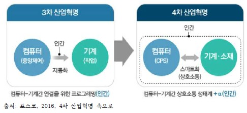

## 4차 산업혁명의 도래

>정보사회화

## 4차 산업혁명의 개념
**4차 산업혁명** The Fourth Instruction Revolutioon은 2016년 디보스포럼 Davos Forum에서 클라우스 슈밥 klaus Schwab이 처음 제시한 개념이다.아직까지 충분한 논의가 이루어지지않아 그 의미가 명확히 정립된 것은 아니다. 4차 산업혁명을 정의하기란 쉽지 않지만, 최근의 논의를 종합해보면 '3차 산업혁명을 기반으로 하여 디지털,생물학,물리학 등의 경계가 없어지고 융합되는 기술혁명',또는 '인터넷을 통해 모아진 인간의 행위와 생각을 온라인상의 거대한 데이터 저장고에 활용하는 일련의 경제적 활동'으로 정의할 수 있다.

## 4차 산업혁명의 특징
사물인터넷과 클라우드,빅데이터 등은 4차 산업혁명을 상징하는 단어이다.특히 4차 산업혁명은 속도,범위,영향력 등의 측면에서 3차 산업혁명과 차별화되고,인류가 한 번도 경험하지 못한 새로운 시대를 접하게 될 것이라고 강조되고 있다. 즉 획기적인 기술 진보,파괴적 기술에 의한 산업 재편,전반적인 시스템 변화 등이 4차 산업 혁명의 주요 특징 이라 할수 있다.
|구분|설명|

## 4차 산업혁명 시대의 도시

**4차 산업혁명 대표적인 기술**

-빅데이터
-인공지능
    -머신러닝
    -딥러닝
-사물인터넷(IOT)
-가상현실
-블록체인
-핀테크
